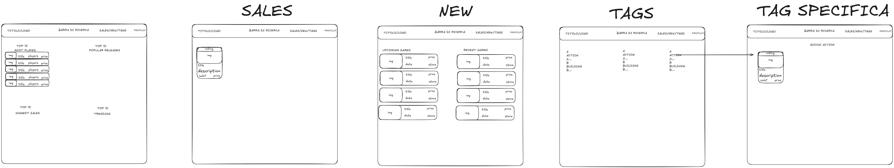

# SteamData Frontend

Una dashboard moderna per monitorare giochi Steam, offerte e prossime uscite.

## User Story

**Obiettivo Principale:**  
Come giocatore PC che vuole risparmiare e rimanere aggiornato, voglio una dashboard centralizzata dove vedere i giochi di tendenza, le migliori offerte su Steam e le prossime uscite, così da poter prendere decisioni d'acquisto informate senza dover navigare su multipli siti lenti.

**Funzionalità Chiave:**

- **Monitora Offerte:** Vedi sconti in tempo reale da CheapShark, filtrati per Steam, per cogliere i cali di prezzo immediatamente.
- **Link Intelligenti:** Clicca direttamente alla pagina del Negozio Steam (saltando intermediari) per acquistare i giochi velocemente.
- **Scopri Tendenze:** Vedi cosa viene giocato e cosa va di moda ora usando i dati di RAWG.
- **Pianifica:** Controlla il Calendario Rilasci per sapere quando verranno lanciati i titoli attesi.
- **Ricchezza Visiva:** Sfoglia i giochi con copertine in alta qualità e confronti di prezzo chiari (Originale vs Scontato).

## Wireframe

Corrisponde al design approvato dal product owner:

